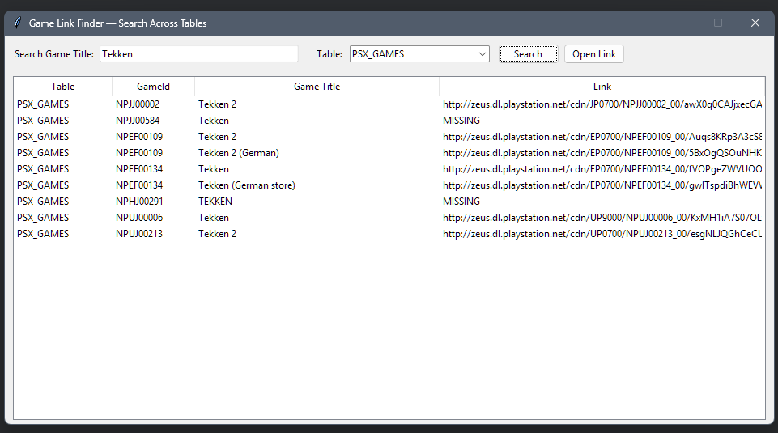
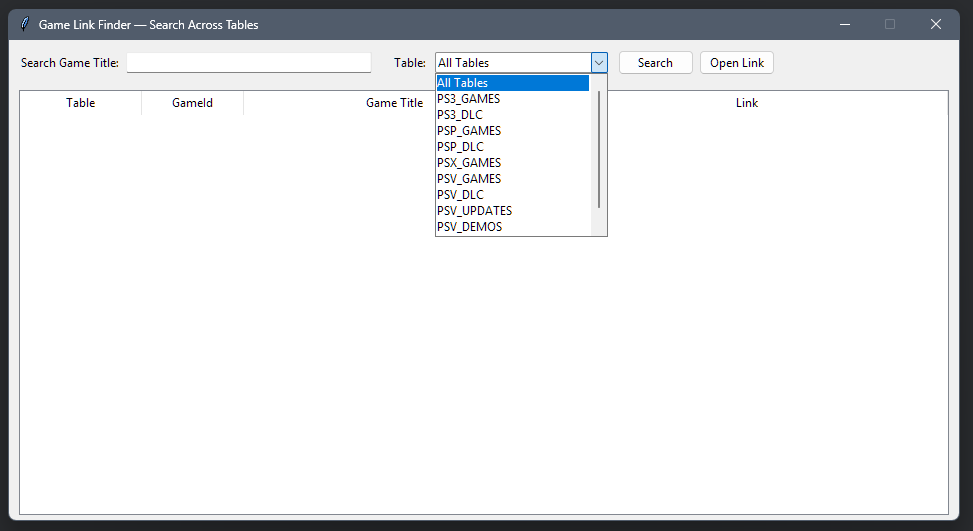

# PS Link Finder

Database (SQ-Lite) which contains ID's:
- for almost all NAMCO357 games
- for almost all PS3 games.
- for almost all PSP/PSN Games.
- for almost all PS Vita/PSN Games.
- for almost all PSX/PSN Games.
  and more...

Use DB Browser: https://sqlitebrowser.org/

Features:
- Gui with search option and button to open the link (download).
- Update: filter and search on all tables or on a specific table instead of only on all tables.
- Update: clean-up.

ToDo: clean up the databases.

            
**[RobertoTorino](https://github.com/RobertoTorino)**        
